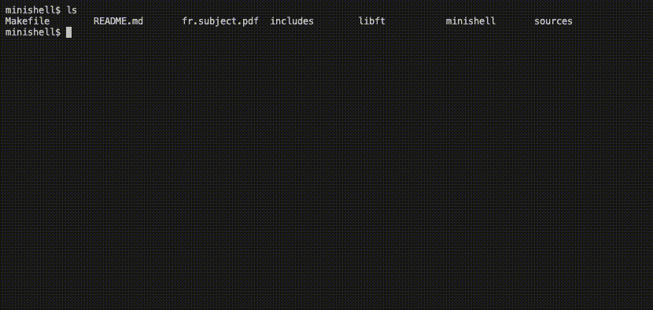
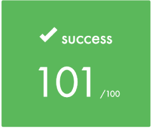
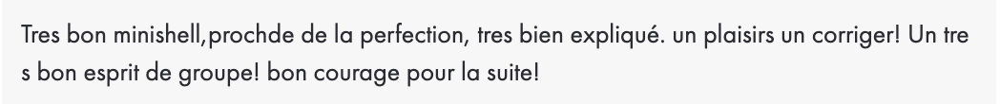
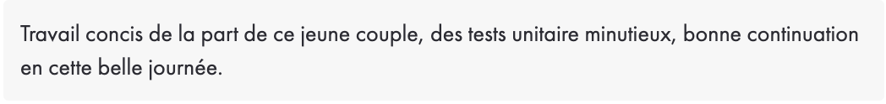
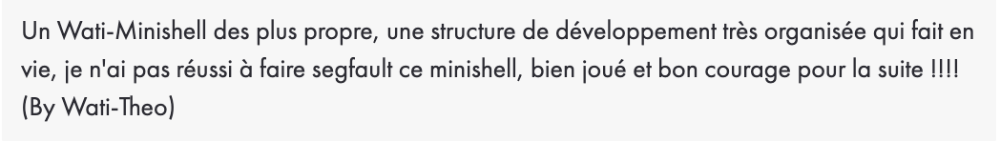

<h1 align="center">Minishell</h1>

Septième projet de [42](https://42.fr/) et premier projet de groupe.

L'objectif est de recréer un petit shell avec les caractéristiques suivantes :

- Historique des commandes
- Variables d'environements
- Redirections et pipes
- Signaux <kbd>ctrl</kbd> +  <kbd>c</kbd>, <kbd>ctrl</kbd> +  <kbd>d</kbd>, <kbd>ctrl</kbd> + <kbd> \ </kbd>

Ainsi que les builtins suivants :

- `echo` (avec l'option -n)
- `cd` (uniquement avec le chemin relatif ou absolu)
- `pwd` (sans aucune option)
- `export` (sans aucune option)
- `unset` (sans aucune option)
- `env` (sans aucune option ou argument)
- `exit` (sans aucune option)

---

### Compilation :

Pour compiler le projet, exécutez la commande suivante :

```
make
```

Pour compiler les tests unitaires, exécutez la commande suivante :

```
make test
```

### Utilisation :

Pour lancer le programme, `./minishell` `mode debug`

Exemple :

```
./minishell DEBUG=0
```

##### Debug 1, affichage des nodes :

```txt
-------- 🚧 DEBUG 🚧 --------
         🧩 node: 0 
  builtin: 0 
  path: /bin/ls 
  args: /bin/ls 
  args: -la 
  fd_in : 0 
  fd_out : 0 
  pipe_in : 5 
  pipe_out : 6 
  error: 0 

-----------------------------
```

##### Debug 2, affichage du découpage du parsing :

```txt
-------- 🚧 DEBUG 🚧 --------
         🧲 parsing: 6 
{echo}{pif}{|}{cat}{|}{rev}

-----------------------------
```

##### Debug 3, affichage de la liste chainées des variables d'environements :

```txt
-------- 🚧 DEBUG 🚧 --------
         💈 lst_env: 
--- 
  key : _ 
  value : /usr/bin/env 
  displayable : 1 
--- 
  key : PWD 
  value : /Users/*****/Projets/42/minishell-private 
  displayable : 1 
-----------------------------
```

Les tests unitaires s'executent de la façon suivante :

```
./utest
```

### Démonstration :



### Intégration continue :

[](https://github.com/Florian-A/Minishell/actions/workflows/norm.yml) [](https://github.com/Florian-A/Minishell/actions/workflows/utest+build.yml)

---

### Correction :

| |
| --- |
|  |

| | |
| --- | --- |
| Correcteur 1 |  |
| Correcteur 2 |  |
| Correcteur 3 |  |

---

### Contributeurs

|  |  |
|:-----------------------------------------------------------:|:--------------------------------------------------------:|
| **[Yvan](https://github.com/ycurbill)**          | **[Florian](https://github.com/florian-a)**           |
